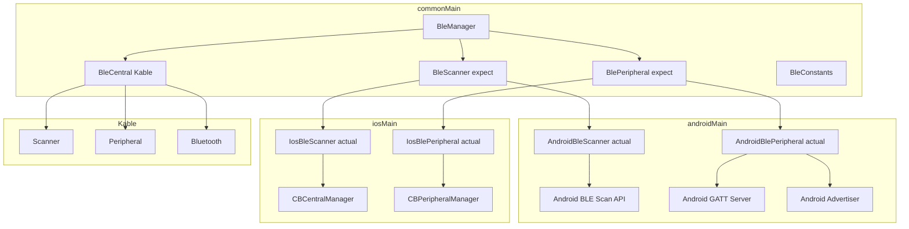

# Миграция BLE на Kable + expect/actual

## Текущая архитектура

```
androidMain/
├── ble/
│   ├── manager/BleManager.kt        ← оркестратор (Android-specific)
│   ├── scanner/BleScanner.kt        ← сканирование (Android API)
│   ├── service/BleMeshService.kt    ← GATT Server + Advertising (Android API)
│   └── model/BleConstants.kt        ← UUID константы
```

## Целевая архитектура

```
commonMain/
├── ble/
│   ├── BleConstants.kt              ← перенести из androidMain
│   ├── BleManager.kt                ← новый общий оркестратор
│   ├── BleCentral.kt                ← Kable-based: connect, write, disconnect
│   ├── BleScanner.kt                ← expect interface
│   └── BlePeripheral.kt             ← expect interface
│
androidMain/
├── ble/
│   ├── AndroidBleScanner.kt         ← actual: Android BLE Scan API
│   └── AndroidBlePeripheral.kt      ← actual: GATT Server + Advertising
│
iosMain/
├── ble/
│   ├── IosBleScanner.kt             ← actual: CBCentralManager
│   └── IosBlePeripheral.kt          ← actual: CBPeripheralManager
```

## Детальный план

### Фаза 1: Подготовка commonMain

#### 1.1 Перенести BleConstants
- Переместить `BleConstants.kt` из `androidMain` в `commonMain`
- Заменить `java.util.UUID` на `kotlinx.datetime` или оставить UUID (он в stdlib)

#### 1.2 Создать expect интерфей

```kotlin
// commonMain/ble/BleScanner.kt
expect class BleScanner() {
    fun isBleSupported(): Boolean
    fun isBluetoothEnabled(): Boolean
    fun scanForDevices(): Flow<MeshDevice>
    fun stopScanning()
}
```

```kotlin
// commonMain/ble/BlePeripheral.kt
expect class BlePeripheral(
    onAdvertisingStateChanged: (Boolean) -> Unit,
    onConnectionStateChanged: (ConnectionState) -> Unit,
    onReceivedData: (ByteArray) -> Unit
) {
    fun startService(): Flow<Boolean>
    fun stopService()
    fun sendData(deviceAddress: String, data: ByteArray): Boolean
    fun createMeshPacket(packetId: String, ttl: Int, hopCount: Int, payload: ByteArray): ByteArray
}
```

#### 1.3 Создать BleCentral на Kable

```kotlin
// commonMain/ble/BleCentral.kt
class BleCentral {
    fun connect(deviceAddress: String): Flow<ConnectionState>
    fun writeCharacteristic(deviceAddress: String, data: ByteArray): Boolean
    fun disconnect(deviceAddress: String)
    fun observeNotifications(deviceAddress: String): Flow<ByteArray>
}
```

### Фаза 2: Android actual реализации

#### 2.1 AndroidBleScanner
- Обернуть текущий [`BleScanner`](composeApp/src/androidMain/kotlin/com/meshovik/ble/scanner/BleScanner.kt:1) в `actual class`
- Минимальные изменения — текущая реализация уже хороша

#### 2.2 AndroidBlePeripheral
- Выделить логику из [`BleMeshService`](composeApp/src/androidMain/kotlin/com/meshovik/ble/service/BleMeshService.kt:1)
- GATT Server + Advertising остаются на Android API
- Адаптировать под expect интерфейс

### Фаза 3: iOS actual реализации

#### 3.1 IosBleScanner
- Использовать `CBCentralManager` для сканирования
- Фильтр по service UUID: `A1B2C3D4-E5F6-7890-A1B2-C3D4E5F67890`
- Маппинг `CBPeripheral` → `MeshDevice`

#### 3.2 IosBlePeripheral
- Использовать `CBPeripheralManager` для GATT Server
- Использовать `CBPeripheralManager.startAdvertising()` для рекламы
- Маппинг CoreBluetooth → общие модели

### Фаза 4: Переписать BleManager

```kotlin
// commonMain/ble/BleManager.kt
class BleManager(
    private val bleScanner: BleScanner,
    private val bleCentral: BleCentral,
    private val blePeripheral: BlePeripheral
) {
    // State flows
    val discoveredDevices: StateFlow<List<MeshDevice>>
    val receivedMessages: StateFlow<List<MeshMessage>>
    val isScanning: StateFlow<Boolean>
    val isAdvertising: StateFlow<Boolean>
    val connectionStates: StateFlow<Map<String, ConnectionState>>
    
    // Methods
    fun startScanning()
    fun stopScanning()
    fun startMeshService(): Flow<Boolean>
    fun stopMeshService()
    fun sendMessage(targetAddress: String, content: String): MeshMessage
    fun broadcastMessage(content: String): MeshMessage
}
```

### Фаза 5: Обновить DI

```kotlin
// commonMain/di/CommonModule.kt
val commonModule = module {
    single { BleCentral() }
    factory { BleManager(get(), get(), get()) }
}

// androidMain/di/AndroidModule.kt
val androidModule = module {
    single { BleScanner() }
    single { BlePeripheral(...) }
}

// iosMain/di/IosModule.kt
val iosModule = module {
    single { BleScanner() }
    single { BlePeripheral(...) }
}
```

## Mermaid диаграмма архитектуры



## Риски и митигация

| Риск | Митигация |
|------|-----------|
| Kable API может отличаться от текущей логики | Адаптировать BleCentral под Kable API, сохранить семантику |
| iOS CoreBluetooth имеет ограничения | Проверить поддержку advertising на iOS (требуется iOS 13+) |
| MTU различается на платформах | Использовать минимальный MTU или фрагментацию |
| Permissions различаются | Настроить AndroidManifest и Info.plist |

## Файловая структура после миграции

```
composeApp/src/
├── commonMain/kotlin/com/meshovik/
│   ├── ble/
│   │   ├── BleConstants.kt
│   │   ├── BleManager.kt
│   │   ├── BleCentral.kt
│   │   ├── BleScanner.kt (expect)
│   │   └── BlePeripheral.kt (expect)
│   ├── di/
│   │   └── CommonModule.kt
│   └── ...
│
├── androidMain/kotlin/com/meshovik/
│   ├── ble/
│   │   ├── AndroidBleScanner.kt (actual)
│   │   └── AndroidBlePeripheral.kt (actual)
│   ├── di/
│   │   └── AndroidModule.kt
│   └── ...
│
└── iosMain/kotlin/com/meshovik/
    ├── ble/
    │   ├── IosBleScanner.kt (actual)
    │   └── IosBlePeripheral.kt (actual)
    └── di/
        └── IosModule.kt
```
