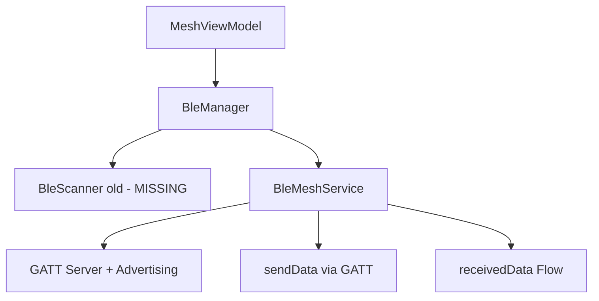
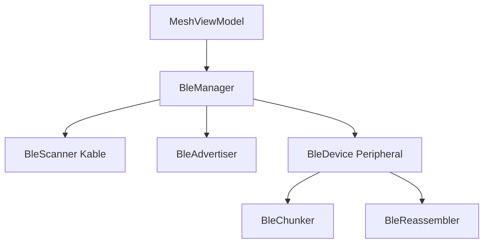
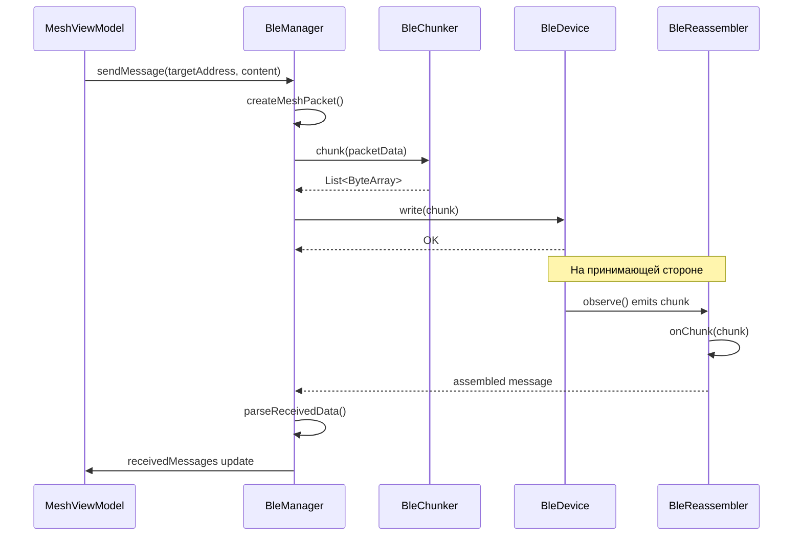

# План перехода на собственные BLE-компоненты

## Обзор

Заменяем старую реализацию (`BleMeshService`, отсутствующий `BleScanner` из пакета `ble.scanner`) на новые Kable-based компоненты (`BleScanner`, `BleDevice`, `BleAdvertiser`, `BleChunker`, `BleReassembler`).

## Текущая архитектура



## Целевая архитектура



## Детальный план

### Фаза 1: Подготовка новых компонентов

#### 1.1 Синхронизация UUID

**Файлы:** `BleDevice.kt`, `BleScanner.kt`

Текущие UUID в новых компонентах:
- SERVICE_UUID: `12345678-1234-1234-1234-1234567890ab`
- CHAR_UUID: `87654321-4321-4321-4321-ba0987654321`

UUID в BleConstants:
- MESH_SERVICE_UUID: `A1B2C3D4-E5F6-7890-A1B2-C3D4E5F67890`
- MESH_DATA_CHARACTERISTIC_UUID: `a1b2c3d4-e5f6-7890-abcd-ef1234567891`

**Действие:** Заменить UUID в `BleDevice` и `BleScanner` на значения из `BleConstants`.

#### 1.2 Перемещение BleChunker и BleReassembler

**Файлы:** `BleChunker.kt`, `BleReassembler.kt`

Текущий пакет: `com`
Целевой пакет: `com.meshovik`

**Действие:** Изменить `package com` на `package com.meshovik` в обоих файлах. Обновить импорты.

#### 1.3 Дополнение BleScanner

**Файл:** `BleScanner.kt`

Текущий `BleManager` вызывает методы, которых нет в новом `BleScanner`:
- `isBleSupported()` — проверка поддержки BLE
- `isBluetoothEnabled()` — проверка включённости Bluetooth
- `stopScanning()` — остановка сканирования
- `scanForDevices()` — возвращает `Flow<MeshDevice>`, а не `Flow<Advertisement>`

**Действие:** Добавить в `BleScanner`:
```kotlin
fun isBleSupported(): Boolean
fun isBluetoothEnabled(): Boolean
fun stopScanning()
fun scanForDevices(): Flow<MeshDevice>  // маппинг Advertisement -> MeshDevice
```

#### 1.4 Дополнение BleAdvertiser

**Файлы:** `BleAdvertiser.kt` (common), `BleAdvertiser.kt` (android)

Текущий `BleManager` ожидает `Flow<Boolean>` для состояния advertising.

**Действие:** Добавить в `BleAdvertiser`:
```kotlin
// expect в common
val advertisingState: Flow<Boolean>

// actual в android
override val advertisingState: Flow<Boolean> = callbackFlow { ... }
```

### Фаза 2: Рефакторинг BleManager

**Файл:** `BleManager.kt`

#### 2.1 Замена зависимостей

Было:
```kotlin
private val bleScanner = BleScanner(context)        // из ble.scanner (отсутствует)
private val bleMeshService = BleMeshService(context) // GATT Server
```

Стало:
```kotlin
private val bleScanner = BleScanner()               // com.meshovik.BleScanner
private val bleAdvertiser = BleAdvertiser(context)  // com.meshovik.BleAdvertiser
private val reassembler = BleReassembler()
private val connectedDevices = mutableMapOf<String, BleDevice>()
```

#### 2.2 Замена startMeshService()

Было:
```kotlin
fun startMeshService(): Flow<Boolean> {
    return bleMeshService.startService()
}
```

Стало:
```kotlin
fun startMeshService(): Flow<Boolean> {
    return bleAdvertiser.advertisingState
        .also { bleAdvertiser.startAdvertising() }
}
```

#### 2.3 Замена stopMeshService()

Было:
```kotlin
fun stopMeshService() {
    bleMeshService.stopService()
}
```

Стало:
```kotlin
fun stopMeshService() {
    bleAdvertiser.stopAdvertising()
}
```

#### 2.4 Замена startScanning()

Было:
```kotlin
bleScanner.scanForDevices().collectLatest { device -> ... }
```

Стало:
```kotlin
bleScanner.scanForDevices().collectLatest { device ->
    _discoveredDevices.update { devices ->
        val existingIndex = devices.indexOfFirst { it.address == device.address }
        if (existingIndex >= 0) {
            devices.toMutableList().apply { this[existingIndex] = device }
        } else {
            devices + device
        }
    }
}
```

#### 2.5 Замена sendData() в sendMessage() и broadcastMessage()

Было:
```kotlin
val success = bleMeshService.sendData(targetAddress, packetData)
```

Стало:
```kotlin
val device = connectedDevices[targetAddress]
if (device != null) {
    val chunks = BleChunker(mtu = 20).chunk(packetData)
    chunks.forEach { chunk -> device.write(chunk) }
} else {
    // Подключиться, отправить, сохранить
    val newDevice = BleDevice(advertisement)
    newDevice.connect()
    connectedDevices[targetAddress] = newDevice
    // ... отправка
}
```

#### 2.6 Замена receivedData

Было:
```kotlin
bleMeshService.receivedData.collectLatest { data -> ... }
```

Стало:
```kotlin
// Для каждого подключённого устройства
device.observe().collectLatest { chunk ->
    val message = reassembler.onChunk(chunk)
    if (message != null) {
        _receivedMessages.update { it + parseReceivedData(message) }
    }
}
```

#### 2.7 Удаление импортов

Убрать из `BleManager.kt`:
```kotlin
import com.meshovik.ble.scanner.BleScanner
import com.meshovik.ble.service.BleMeshService
```

Добавить:
```kotlin
import com.meshovik.BleScanner
import com.meshovik.BleAdvertiser
import com.meshovik.BleDevice
import com.BleChunker
import com.BleReassembler
```

### Фаза 3: Рефакторинг MeshViewModel

**Файл:** `MeshViewModel.kt`

#### 3.1 Упрощение зависимостей

Было:
```kotlin
class MeshViewModel(
    private val bleManager: BleManager,
    private val meshRepository: MeshRepository,
    private val scanner: BleScanner,
    private val advertiser: BleAdvertiser
) : ViewModel()
```

Стало:
```kotlin
class MeshViewModel(
    private val bleManager: BleManager,
    private val meshRepository: MeshRepository
) : ViewModel()
```

#### 3.2 Удаление дублирующего scanJob

В текущем `MeshViewModel` есть `scanJob`, который дублирует логику `BleManager.startScanning()`.

Было:
```kotlin
fun startScanning() {
    scanJob = scope.launch {
        scanner.scan().collect { adv ->
            bleManager.discoveredDevices.update { it + adv } // ошибка типа!
        }
    }
}
```

Стало:
```kotlin
fun startScanning() {
    bleManager.startScanning()
}
```

#### 3.3 Удаление неиспользуемых полей

Убрать:
```kotlin
private var device: BleDevice? = null
private var scanJob: Job? = null
private var observeJob: Job? = null
```

### Фаза 4: Обновление DI

**Файл:** `AndroidModule.kt`

Было:
```kotlin
val androidModule = module {
    single { BleManager(androidContext()) }
    viewModel { MeshViewModel(get(), get(), get(), get()) }
}
```

Стало:
```kotlin
val androidModule = module {
    single { BleManager(androidContext()) }
    viewModel { MeshViewModel(get(), get()) }
}
```

### Фаза 5: Удаление старых файлов

Удалить:
- `composeApp/src/androidMain/kotlin/com/meshovik/ble/service/BleMeshService.kt`
- `composeApp/src/androidMain/kotlin/com/meshovik/ble/scanner/` (пустая директория)
- При необходимости: `composeApp/src/androidMain/kotlin/com/meshovik/ble/` (если больше не нужен)

Сохранить:
- `composeApp/src/androidMain/kotlin/com/meshovik/ble/model/BleConstants.kt` — нужен для UUID

### Фаза 6: Финальные проверки

- Проверить что все импорты корректны
- Проверить что `BleAdvertiser` actual-реализация на Android работает с `callbackFlow`
- Проверить что `BleScanner.scanForDevices()` корректно маппит `Advertisement` в `MeshDevice`
- Убедиться что `BleReassembler` корректно собирает чанки из `observe()` потока

## Диаграмма последовательности отправки сообщения



## Замечания

1. **GATT Server**: В текущем плане GATT Server не реализуется. Устройство работает только в режиме central (подключается к другим). Для полноценной mesh-сети потребуется добавить GATT Server отдельным компонентом в будущем.

2. **Управление подключениями**: Новый `BleManager` должен хранить `Map<String, BleDevice>` для отслеживания подключённых устройств.

3. **MTU**: `BleChunker` использует MTU=20 по умолчанию. Это значение можно сделать настраиваемым.

4. **Deduplication**: Старый `BleMeshService` имел дедупликацию пакетов. В новой реализации это нужно будет добавить в `BleReassembler` или `BleManager`.
