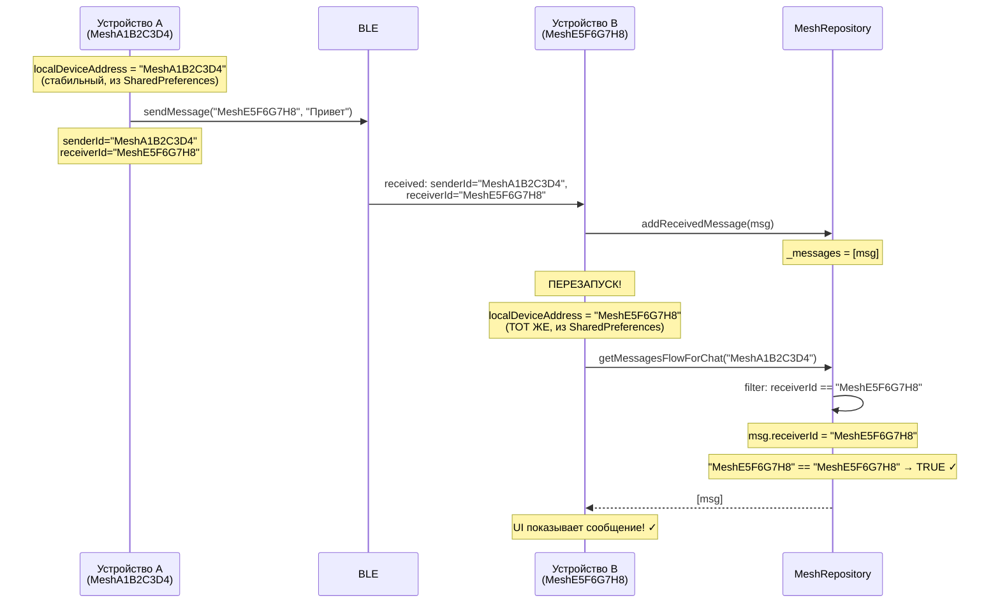

# План: Стабильный идентификатор устройства (SharedPreferences UUID)

## Проблема

В [`BleManager.initializeLocalDeviceInfo()`](composeApp/src/androidMain/kotlin/com/meshovik/ble/manager/BleManager.kt:90-94):

```kotlin
localDeviceAddress = "Skibidi${(1..10).random()}"
```

При каждом запуске приложения `localDeviceAddress` — новый рандомный. Это ломает:
- Фильтрацию сообщений в ЛС (receiverId != localDeviceAddress)
- Определение "своих" сообщений (isFromMe = senderId == localDeviceAddress)
- Идентификацию чатов (chat.id == participantAddress)

## Решение: SharedPreferences UUID

### Архитектура

```mermaid
graph TD
    A[BleManager] -->|getLocalAddress()| B[DeviceIdProvider]
    B -->|Android| C[AndroidDeviceIdProvider]
    B -->|iOS| D[IosDeviceIdProvider]
    C -->|читает/сохраняет| E[SharedPreferences]
    D -->|читет/сохраняет| F[UserDefaults]
    E -->|хранит| G["Mesh{UUID}"]
    F -->|хранит| G
```

### Формат идентификатора

```
Mesh{8 hex chars}
```

Пример: `MeshA1B2C3D4`

Префикс `Mesh` для отладки, 8 символов UUID — достаточно уникальности.

---

## Файлы для изменения

### 1. Новый файл: `DeviceIdProvider` (expect/actual)

**`composeApp/src/commonMain/kotlin/com/meshovik/core/util/DeviceIdProvider.kt`**

```kotlin
package com.meshovik.core.util

/**
 * Provides a stable device identifier that persists across app restarts.
 */
expect class DeviceIdProvider {
    /**
     * Returns a stable device ID, generating one if it doesn't exist.
     */
    fun getDeviceId(): String
}
```

**`composeApp/src/androidMain/kotlin/com/meshovik/core/util/DeviceIdProvider.android.kt`**

```kotlin
package com.meshovik.core.util

import android.content.Context
import java.util.UUID

actual class DeviceIdProvider(
    private val context: Context
) {
    actual fun getDeviceId(): String {
        val prefs = context.getSharedPreferences("mesh_prefs", Context.MODE_PRIVATE)
        return prefs.getString("device_id", null) ?: run {
            val newId = "Mesh${UUID.randomUUID().toString().take(8).replace("-", "").take(8)}"
            prefs.edit().putString("device_id", newId).apply()
            newId
        }
    }
}
```

**`composeApp/src/iosMain/kotlin/com/meshovik/core/util/DeviceIdProvider.ios.kt`** (на будущее)

```kotlin
package com.meshovik.core.util

import platform.Foundation.NSUserDefaults
import platform.Foundation.NSUUID

actual class DeviceIdProvider {
    actual fun getDeviceId(): String {
        val defaults = NSUserDefaults.standardUserDefaults
        return defaults.stringForKey("device_id") ?: run {
            val newId = "Mesh${NSUUID.UUID().UUIDString.take(8)}"
            defaults.setObject(newId, "device_id")
            defaults.synchronize()
            newId
        }
    }
}
```

---

### 2. Изменить: `BleManager.kt`

**Файл:** `composeApp/src/androidMain/kotlin/com/meshovik/ble/manager/BleManager.kt`

**Что изменить:**

```kotlin
// БЫЛО:
class BleManager(
    private val context: Context
) {
    // ...
    private fun initializeLocalDeviceInfo() {
        localDeviceAddress = "Skibidi${(1..10).random()}"
        localDeviceName = "Meshovik Device"
        Timber.i("Local device: $localDeviceName ($localDeviceAddress)")
    }
}

// СТАНЕТ:
class BleManager(
    private val context: Context
) {
    private val deviceIdProvider = DeviceIdProvider(context)  // ← новое поле
    
    // ...
    private fun initializeLocalDeviceInfo() {
        localDeviceAddress = deviceIdProvider.getDeviceId()  // ← стабильный ID
        localDeviceName = "Meshovik Device"
        Timber.i("Local device: $localDeviceName ($localDeviceAddress)")
    }
}
```

---

### 3. Изменить: `AndroidModule.kt` (DI)

**Файл:** `composeApp/src/androidMain/kotlin/com/meshovik/di/AndroidModule.kt`

Если `BleManager` создаётся через DI — убедиться что `Context` передаётся корректно.

---

### 4. НЕ меняются (работают как есть)

Эти файлы используют `localDeviceAddress` через `bleManager.getLocalAddress()` — **не требуют изменений**:

| Файл | Использование |
|------|--------------|
| `MeshViewModel.kt:25` | `bleManager.getLocalAddress()` |
| `MeshViewModel.kt:175` | `meshRepository.getMessagesFlowForChat(chatId, localDeviceAddress)` |
| `MeshViewModel.kt:181` | `meshRepository.getMessagesForChat(chatId, localDeviceAddress)` |
| `MeshRepository.kt:62-82` | Фильтрация по `localDeviceAddress` |
| `MeshRepository.kt:84-115` | `getMessagesFlowForChat()` |
| `DirectChatScreen.kt:66` | `uiState.localDeviceAddress` |
| `BroadcastChatScreen.kt:65` | `uiState.localDeviceAddress` |
| `BleManager.kt:207` | `address != localDeviceAddress` (проверка "не подключаться к себе") |
| `BleManager.kt:247` | `address == localDeviceAddress` (проверка) |
| `BleManager.kt:317` | `senderId = localDeviceAddress` (отправка) |
| `BleManager.kt:353` | `senderId = localDeviceAddress` (broadcast) |

---

## План миграции

### Этап 1: Создание DeviceIdProvider

1. Создать `composeApp/src/commonMain/kotlin/com/meshovik/core/util/DeviceIdProvider.kt` (expect)
2. Создать `composeApp/src/androidMain/kotlin/com/meshovik/core/util/DeviceIdProvider.android.kt` (actual)
3. Создать `composeApp/src/iosMain/kotlin/com/meshovik/core/util/DeviceIdProvider.ios.kt` (actual, на будущее)

### Этап 2: Интеграция в BleManager

1. Добавить поле `deviceIdProvider` в `BleManager`
2. Заменить `initializeLocalDeviceInfo()` на использование `deviceIdProvider.getDeviceId()`

### Этап 3: Тестирование

1. Установить приложение на устройство A — проверить что ID стабильный после перезапуска
2. Установить на устройство B — проверить что ID отличается от A
3. Отправить сообщение A → B — проверить что B видит `senderId` и `receiverId` корректно
4. Перезапустить B — проверить что сообщения в ЛС всё ещё отображаются

### Этап 4: Фикс дубликатов (бонус)

Заодно добавить проверку дубликатов в `MeshRepository`:

```kotlin
fun addReceivedMessage(message: MeshMessage) {
    _messages.update { messages ->
        if (messages.any { it.id == message.id }) messages
        else messages + message
    }
    // ...
}

fun addSentMessage(message: MeshMessage) {
    _sentMessages.update { messages ->
        if (messages.any { it.id == message.id }) messages
        else messages + message
    }
    // ...
}
```

### Этап 5: Фикс краша Broadcast

В `BroadcastChatScreen.kt` и `DirectChatScreen.kt`:

```kotlin
val broadcastMessages by messagesFlow.collectAsState(initial = emptyList())
val directMessages by messagesFlow.collectAsState(initial = emptyList())
```

---

## Диаграмма последовательности (после фикса)



---

## Риски и митигация

| Риск | Вероятность | Влияние | Митигация |
|------|------------|---------|-----------|
| Пользователь очистит данные приложения | Низкая | ID изменится, старые сообщения не отобразятся | Можно добавить бэкап в облако позже |
| Конфликт ID (крайне маловероятно) | Очень низкая | Два устройства с одинаковым ID | 8 hex chars = 4.3 млрд комбинаций |
| iOS реализация отстанет | Средняя | iOS будет использовать рандом | Временный fallback на рандом с сохранением |

---

## Итоговый чеклист

- [ ] Создать `DeviceIdProvider.kt` (common expect)
- [ ] Создать `DeviceIdProvider.android.kt` (android actual)
- [ ] Создать `DeviceIdProvider.ios.kt` (ios actual, опционально)
- [ ] Изменить `BleManager.initializeLocalDeviceInfo()`
- [ ] Добавить проверку дубликатов в `MeshRepository.addReceivedMessage()`
- [ ] Добавить проверку дубликатов в `MeshRepository.addSentMessage()`
- [ ] Добавить `initial = emptyList()` в `BroadcastChatScreen.collectAsState()`
- [ ] Добавить `initial = emptyList()` в `DirectChatScreen.collectAsState()`
- [ ] Протестировать на двух устройствах
