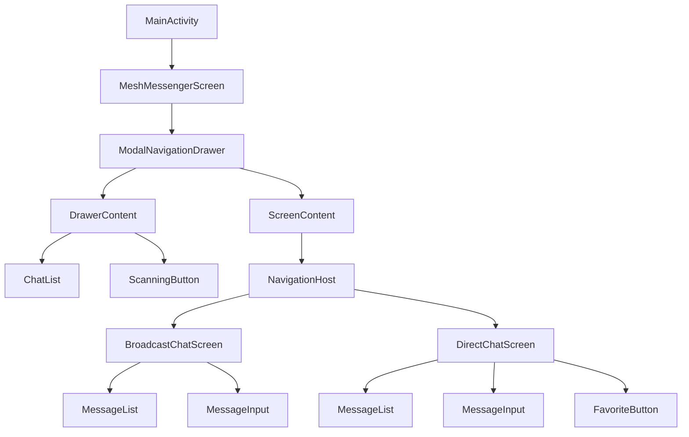

# План редизайна UI Meshovik

## Обзор задачи

Редизайн интерфейса для разделения broadcast и личных сообщений, добавления бокового меню с чатами, системы избранных контактов и стабильных идентификаторов устройств.

---

## 1. Стабильный уникальный идентификатор устройства

### Проблема
Сейчас устройства идентифицируются по MAC-адресу, который рандомизируется при каждом запуске.

### Решение
- Добавить поле `stableId: String` в [`MeshDevice`](composeApp/src/commonMain/kotlin/com/meshovik/domain/entity/MeshDevice.kt:11)
- Генерировать `stableId` один раз при первом запуске (UUID v4)
- Сохранять в DataStore/Preferences
- Передавать `stableId` в BLE-пакетах (в payload или advertisement data)
- Обновить [`parseReceivedData()`](composeApp/src/androidMain/kotlin/com/meshovik/ble/manager/BleManager.kt:432) для извлечения stableId

### Файлы для изменения
- `composeApp/src/commonMain/kotlin/com/meshovik/domain/entity/MeshDevice.kt`
- `composeApp/src/androidMain/kotlin/com/meshovik/ble/manager/BleManager.kt`
- `composeApp/src/commonMain/kotlin/com/meshovik/ble/BlePeripheral.kt`
- `composeApp/src/androidMain/kotlin/com/meshovik/BleAdvertiser.kt`

---

## 2. Модель чата и навигация

### Новая сущность Chat

```kotlin
@Serializable
data class Chat(
    val id: String,                    // UUID
    val type: ChatType,                // BROADCAST или DIRECT
    val participantId: String?,        // stableId собеседника (для DIRECT)
    val participantName: String?,      // Имя собеседника
    val lastMessage: String?,          // Текст последнего сообщения
    val lastMessageTime: Instant?,     // Время последнего сообщения
    val unreadCount: Int = 0,          // Количество непрочитанных
    val isFavorite: Boolean = false    // Для DIRECT чатов
)

@Serializable
enum class ChatType {
    BROADCAST,    // Общий чат
    DIRECT        // Личный чат
}
```

### Навигация
Использовать Voyager или Decompose для навигации между экранами:
- `ChatListScreen` - список чатов (главный экран)
- `BroadcastChatScreen` - broadcast чат
- `DirectChatScreen` - личный чат с пользователем

### Файлы для создания
- `composeApp/src/commonMain/kotlin/com/meshovik/domain/entity/Chat.kt`
- `composeApp/src/commonMain/kotlin/com/meshovik/domain/entity/ChatType.kt`

---

## 3. Боковое меню (Drawer) со списком чатов

### Структура Drawer

```
┌─────────────────────────────────┐
│  Meshovik              [⚙️]    │  ← Header с названием и настройками
├─────────────────────────────────┤
│  📡 Broadcast чат               │  ← Всегда первый
├─────────────────────────────────┤
│  ⭐ Избранные                   │  ← Секция (если есть)
│     ├─ User1                    │
│     └─ User2                    │
├─────────────────────────────────┤
│  💬 Другие чаты                 │  ← Секция
│     ├─ User3 (2)                │  ← (2) = непрочитанные
│     └─ User4                    │
├─────────────────────────────────┤
│  [🔍 Сканировать]               │  ← Кнопка сканирования
└─────────────────────────────────┘
```

### Компоненты
- `ChatDrawerContent` - основной контент Drawer
- `ChatDrawerItem` - элемент чата в списке
- `ScanningButton` - кнопка сканирования с круглыми углами

### Файлы для создания
- `composeApp/src/commonMain/kotlin/com/meshovik/presentation/components/ChatDrawer.kt`
- `composeApp/src/commonMain/kotlin/com/meshovik/presentation/components/ScanningButton.kt`

---

## 4. Разделение чатов на Broadcast и Direct

### BroadcastChatScreen
- Отображает все сообщения с receiverId = "BROADCAST"
- Имена отправителей кликабельны
- Клик по имени → переход в DirectChatScreen с этим пользователем

### DirectChatScreen
- Отображает сообщения между localDevice и participantId
- Заголовок с именем собеседника
- Возможность добавить в избранное

### MessageList изменения
- Добавить параметр `onSenderClick: (senderId) -> Unit`
- В broadcast чате - имена кликабельны
- В direct чате - сообщения группируются по отправителю (как в мессенджерах)

### Файлы для создания/изменения
- `composeApp/src/commonMain/kotlin/com/meshovik/presentation/screens/BroadcastChatScreen.kt`
- `composeApp/src/commonMain/kotlin/com/meshovik/presentation/screens/DirectChatScreen.kt`
- `composeApp/src/commonMain/kotlin/com/meshovik/presentation/components/MessageList.kt`

---

## 5. Система избранных контактов

### Entity Contact

```kotlin
@Serializable
data class Contact(
    val deviceId: String,        // stableId устройства
    val displayName: String,     // Пользовательское имя
    val isFavorite: Boolean,     // В избранном
    val lastSeen: Instant?,      // Последний раз в сети
    val rssi: Int = 0            // Сила сигнала
)
```

### ContactRepository
- Хранение контактов в DataStore
- Методы: addContact, removeContact, toggleFavorite, getFavorites

### UI
- Долгое нажатие на имя в broadcast чате → меню "Добавить в контакты"
- В DirectChatScreen - кнопка ⭐ для добавления в избранное
- В Drawer - секция "Избранные" над остальными чатами

### Файлы для создания
- `composeApp/src/commonMain/kotlin/com/meshovik/domain/entity/Contact.kt`
- `composeApp/src/commonMain/kotlin/com/meshovik/data/repository/ContactRepository.kt`
- `composeApp/src/commonMain/kotlin/com/meshovik/presentation/components/ContactDialog.kt`

---

## 6. Кнопка сканирования

### Дизайн
- Круглые углы (shape = RoundedCornerShape(24.dp))
- Текст "Сканировать" / "Остановить"
- Цвет: синий когда не сканирует, красный когда сканирует
- Иконка 🔍 / ⏹ слева от текста
- Анимация пульсации при сканировании

### Расположение
- Внизу бокового меню (Drawer)
- Или в TopAppBar главного экрана

### Файлы для создания
- `composeApp/src/commonMain/kotlin/com/meshovik/presentation/components/ScanningButton.kt`

---

## Архитектура UI



---

## Порядок реализации (ОБНОВЛЁННЫЙ)

1. **Зависимости** - Voyager + DataStore в libs.versions.toml и build.gradle.kts
2. **Модель Chat и ChatType** - новые сущности
3. **MeshRepository обновления** - фильтрация сообщений по типу чата
4. **Навигация** - Voyager Navigator + Screen классы
5. **BroadcastChatScreen** - общий чат с кликабельными именами
6. **DirectChatScreen** - личный чат с пользователем
7. **ChatListScreen** - главный экран со списком чатов
8. **Drawer** - боковое меню с навигацией
9. **ScanningButton** - кнопка сканирования в Drawer
10. **MeshViewModel обновления** - методы для переключения чатов
11. **Стабильный идентификатор** - DeviceIdProvider (ПОСЛЕ UI)
12. **Избранные контакты** - Contact entity + UI

---

## Зависимости

### libs.versions.toml additions

```toml
[versions]
voyager = "1.0.0"
datastore = "1.1.3"

[libraries]
voyager-navigator = { module = "cafe.adriel.voyager:voyager-navigator", version.ref = "voyager" }
voyager-screen-model = { module = "cafe.adriel.voyager:voyager-screenmodel", version.ref = "voyager" }
voyager-bottom-sheet-navigator = { module = "cafe.adriel.voyager:voyager-bottom-sheet-navigator", version.ref = "voyager" }
voyager-tab-navigator = { module = "cafe.adriel.voyager:voyager-tab-navigator", version.ref = "voyager" }
voyager-transitions = { module = "cafe.adriel.voyager:voyager-transitions", version.ref = "voyager" }
androidx-datastore-preferences = { module = "androidx.datastore:datastore-preferences", version.ref = "datastore" }
```

### composeApp/build.gradle.kts additions

В `commonMain.dependencies`:
```kotlin
// Voyager Navigation
implementation(libs.voyager.navigator)
implementation(libs.voyager.screen.model)
implementation(libs.voyager.transitions)

// DataStore Preferences
implementation(libs.androidx.datastore.preferences)
```
